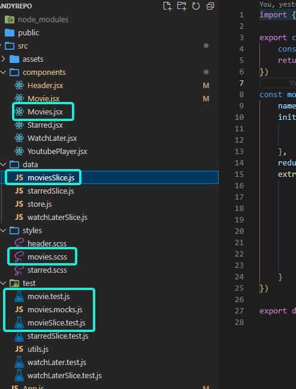

## Project structure
- I will recommend a change of the project structure, its not easy to follow the code when we have everything in one folder.
  
  For small practices its ok, but when the project grows it can be really hard the handle.
  I recommend following the structured from [emberjs](https://cli.emberjs.com/release/advanced-use/project-layouts/)
  
In this case the project can be reordered to something like this


```bash
.
├── Movies/
│   ├── adapters/
|   |     ├── index.test.ts => adapter unit test
|   |     └── index.ts => map response from the server to a local data
│   ├── components/
|   |     ├── index.test.tsx => component unit test
|   |     ├── styles.ts => css style
|   |     └── index.tsx => component code, without logic like api calls etc 
│   ├── containers/
|   |     └── index.ts => export component  
│   ├── hooks/
|   |     └── useMovies.ts => to handle all the logic of the component like, api calls declarations, useEffects, states, redux slice uses, etc
│   ├── models/
|   |     └── index.ts => models used, api response, data model to use in the app
│   ├── services/
|   |     ├── index.test.ts
|   |     └── index.ts  => fetching data 
|   └── index.ts => barrel to export from movies
├── feature2
...
├── featureX
```


  ## Styling
- We should use css-grid and flexBox for positioning elements in a container. 
  - Ex: FlexBox for movie card
  - Ex: Css-grid for movie list
- In this project we might be abusing of the fixed units (px)
- If its important at this stage of the project the media-queries i would recommend use a separate file to set up the prover values and medias and from that point start using it in the app with a mixin. 
- In general we should try to use a className for styling, mixing inline styles and classnames could lead to issues.

Ex: 
```
$phone-screen-width: 375px;
$tablet-screen-width: 768px;
$desktop-screen-width: 1440px;

@mixin phone {
    @media (min-width: #{$phone-screen-width}) and (max-width: #{$tablet-screen-width - 1px}) {
        @content;
    }
}

@mixin tablet {
    @media (min-width: #{$tablet-screen-width}) and (max-width: #{$desktop-screen-width - 1px}) {
        @content;
    }
}

@mixin desktop {
    @media (min-width: #{$desktop-screen-width}) {
        @content;
    }
}
```
Then to use it in the app
```
.stylingSomething {
    ...
    @include tablet {
        custom style here...
    }
}
```

## Unit test

## General Comments
- Wouldn't be a bad idea to introduce [Storybook](https://storybook.js.org/) 
- Components like starred and watchLater are quite similar, they are the perfect candidates to be part of a generic component